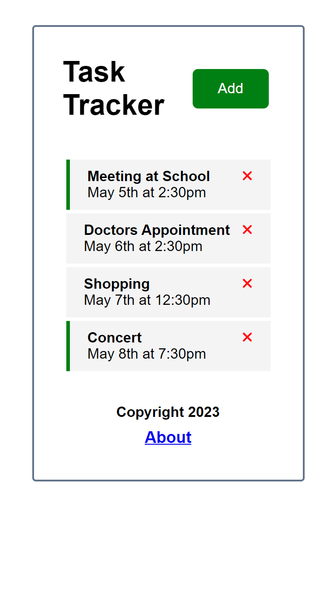

# Task Tracker

[](https://github.com/milliorn/task-tracker/actions/workflows/github-code-scanning/codeql)

Task Tracker is a web application built with Angular that allows users to track and manage their tasks. It provides a simple and intuitive interface for creating, updating, and deleting tasks.

## Technologies Used

- Angular
- JSON Server
- FontAwesome
- RxJS

## Preview



## Installation

To get started with Task Tracker, follow these steps:

1. Clone the repository
2. Navigate to the project directory: `cd task-tracker`
3. Install the dependencies: `npm install`

## Usage

### Development server

Run `ng serve` for a dev server. Navigate to `http://localhost:4200/`. The application will automatically reload if you change any of the source files.

### Code scaffolding

Run `ng generate component component-name` to generate a new component. You can also use `ng generate directive|pipe|service|class|guard|interface|enum|module`.

### Build

Run `ng build` to build the project. The build artifacts will be stored in the `dist/` directory.

### Running unit tests

Run `ng test` to execute the unit tests via [Karma](https://karma-runner.github.io).

### Running end-to-end tests

Run `ng e2e` to execute the end-to-end tests via a platform of your choice. To use this command, you need to first add a package that implements end-to-end testing capabilities.

### Further help

To get more help on the Angular CLI use `ng help` or go check out the [Angular CLI Overview and Command Reference](https://angular.io/cli) page.

### ng commands

<https://angular.io/cli>

## Test Local Server

`npm run server` then `npm run watch` and then `npm run start`.

### JSON Server

Task Tracker uses a JSON server for simulating a backend. To start the JSON server, run the following command:

```bash
npm run server
```

This will start the JSON server at `http://localhost:5000/`. The server will provide the necessary RESTful endpoints for managing tasks.

## Available Scripts

In the project directory, you can run the following scripts:

- `npm run build`: Builds the application for production.
- `npm run lint`: Lints the codebase using Angular's linting rules.
- `npm run test`: Runs the unit tests using Karma and Jasmine.
- `npm run update`: Updates the project dependencies to their latest versions.
- `npm run version`: Displays the version of Angular CLI and other dependencies.

For more available scripts and their descriptions, refer to the `package.json` file.

## Contributing

Contributions are welcome! If you'd like to contribute to Task Tracker, please follow these guidelines:

1. Fork the repository.
2. Create a new branch for your feature or bug fix.
3. Make the necessary changes and commit them.
4. Push your branch to your forked repository.
5. Submit a pull request to the `main` branch of the original repository.

Please ensure that your code follows the project's coding style and conventions.

## License

This project is licensed under the [MIT License](LICENSE).

This project was generated with [Angular CLI](https://github.com/angular/angular-cli) version 15.1.5.
