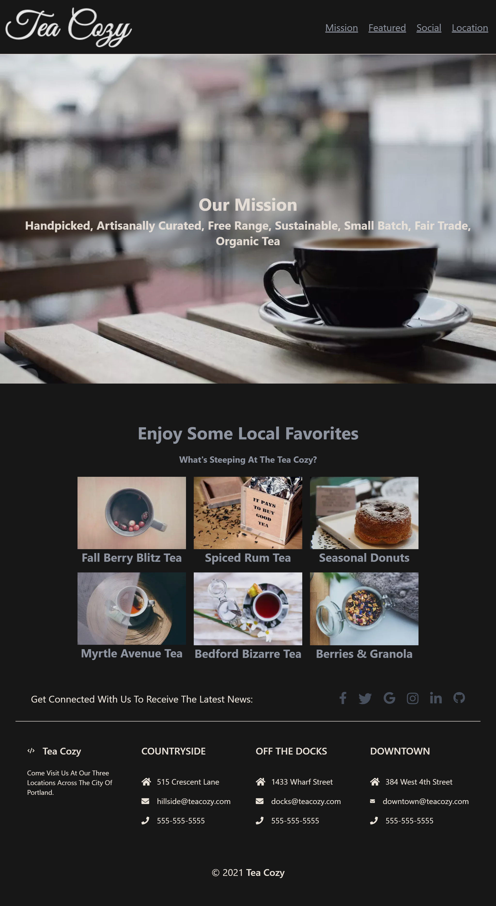

# Tea Cozy

## Description

Tea Cozy is a simple website showcasing a fictional tea shop, "Tea Cozy." The website features various sections, including an introduction to the tea shop, the tea menu, and a contact form to get in touch. It is built using Gatsby.

## Live Demo

You can see the live demo at https://teacozy.gatsbyjs.io/

## Features

- Responsive Design: The website is fully responsive and adjusts to different screen sizes, ensuring a seamless experience across various devices.
- Menu Showcase: Display the tea menu with beautiful images and descriptions of each tea.
- Contact Form: Visitors can reach out to the tea shop using the contact form, providing their name, email, and message.
- Smooth Scrolling: Smooth scrolling functionality for easy navigation through different sections.

## Preview



<p align="center">
  <a href="https://www.gatsbyjs.com/?utm_source=starter&utm_medium=readme&utm_campaign=minimal-starter">
    
  </a>
</p>
<h1 align="center">
  Gatsby minimal starter
</h1>

## 🚀 Quick start

1.  **Create a Gatsby site.**

    Use the Gatsby CLI to create a new site, specifying the minimal starter.

    ```shell
    # create a new Gatsby site using the minimal starter
    npm init gatsby
    ```

2.  **Start developing.**

    Navigate into your new site’s directory and start it up.

    ```shell
    cd my-gatsby-site/
    npm run develop
    ```

3.  **Open the code and start customizing!**

    Your site is now running at http://localhost:8000!

    Edit `src/pages/index.js` to see your site update in real-time!

4.  **Learn more**

    - [Documentation](https://www.gatsbyjs.com/docs/?utm_source=starter&utm_medium=readme&utm_campaign=minimal-starter)

    - [Tutorials](https://www.gatsbyjs.com/tutorial/?utm_source=starter&utm_medium=readme&utm_campaign=minimal-starter)

    - [Guides](https://www.gatsbyjs.com/tutorial/?utm_source=starter&utm_medium=readme&utm_campaign=minimal-starter)

    - [API Reference](https://www.gatsbyjs.com/docs/api-reference/?utm_source=starter&utm_medium=readme&utm_campaign=minimal-starter)

    - [Plugin Library](https://www.gatsbyjs.com/plugins?utm_source=starter&utm_medium=readme&utm_campaign=minimal-starter)

    - [Cheat Sheet](https://www.gatsbyjs.com/docs/cheat-sheet/?utm_source=starter&utm_medium=readme&utm_campaign=minimal-starter)

## 🚀 Quick start (Gatsby Cloud)

Deploy this starter with one click on [Gatsby Cloud](https://www.gatsbyjs.com/cloud/):

[](https://www.gatsbyjs.com/dashboard/deploynow?url=https://github.com/gatsbyjs/gatsby-starter-minimal)
